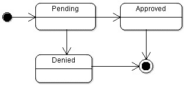

# Employee Reimbursment System (ERS)

## Executive Summary
The Expense Reimbursement System (ERS) will manage the process of reimbursing employees for expenses incurred while on company time. All employees in the company can login and submit requests for reimbursement and view their past tickets and pending requests. Finance managers can log in and view all reimbursement requests and past history for all employees in the company. Finance managers are authorized to approve and deny requests for expense reimbursement.

**State-chart Diagram (Reimbursement Statuses)** 

**Logical Model**

**Physical Model**

**Use Case Diagram**

**Activity Diagram**

## Technical Requirements

The back-end system shall use JDBC to connect to a Postgres database. The middle tier shall use Javalin technology for dynamic Web application development. The front-end view shall use HTML/CSS/JavaScript to make an application that can call server-side components in a generally RESTful manner. The middle tier shall follow proper layered architecture, and have reasonable JUnit test coverage of the service layer. Webpages shall be styled to be functional and readable. 

**Stretch Goals (if you'd like to use this technology):**

* Postgres Database shall be hosted remotely on GCP Cloud SQL. 

* Employees must select the type of reimbursement as: LODGING, TRAVEL, FOOD, or OTHER.

## Misc Notes

* This README should prove helpful when getting the big picture of everything you need to do... However, what should be most helpful to you is actually looking through the skeleton and seeing the required functionality. COE was very generous to already create the required method signatures for you and leave notes on how the various classes should work.

* I (Ben) can only teach you so much -- This project will require you to do a bit of self study (For instance, learning about how enums work. They aren't that scary I promise). Your BEST resource when self studying besides google is each other. You're in teams for a reason! This is a great opportunity to figure out how to articulate your problems to others and help others with their own problems. Web dev is not an introverted role...

* When creating your database, the logical model and physical models above are simply suggestions for best practice... There are easier and harder ways to implement the same thing. For instance, the reimbursements table only **needs** the 5 required fields found in the AbstractReimbursement Class. Similar story with the users table. Further, the reimbursement status is a separate table in the physical model, but you may opt to simply make status a field in the reimbursement table.

* Let me reiterate - HELP EACH OTHER! Don't spend 3 hours on the same problem when you could talk it out with your peers after ~1 hour of bashing your head against stackoverflow.com. But of course, do you own work and make sure to actually learn or you'll have a bad time during P2. 
